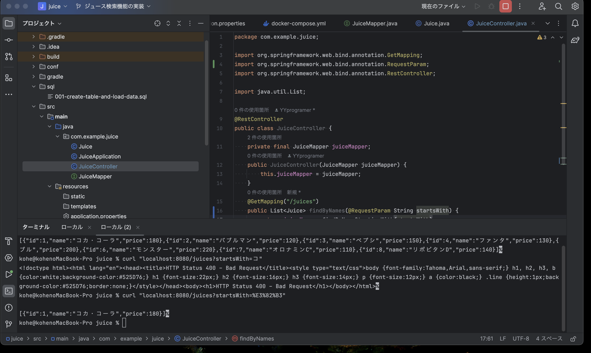
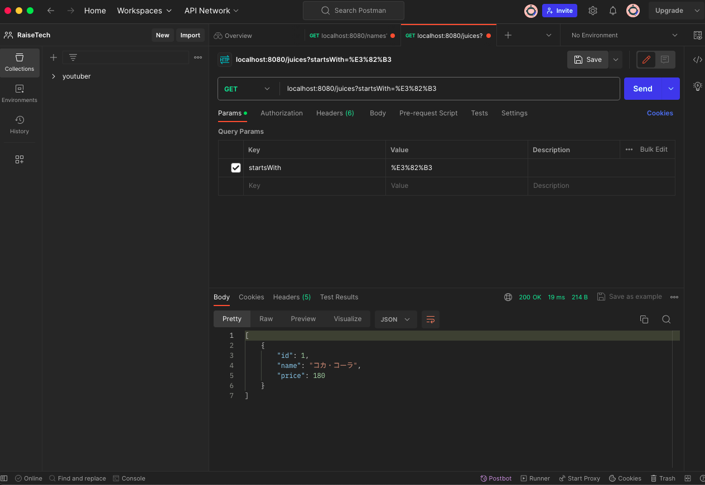
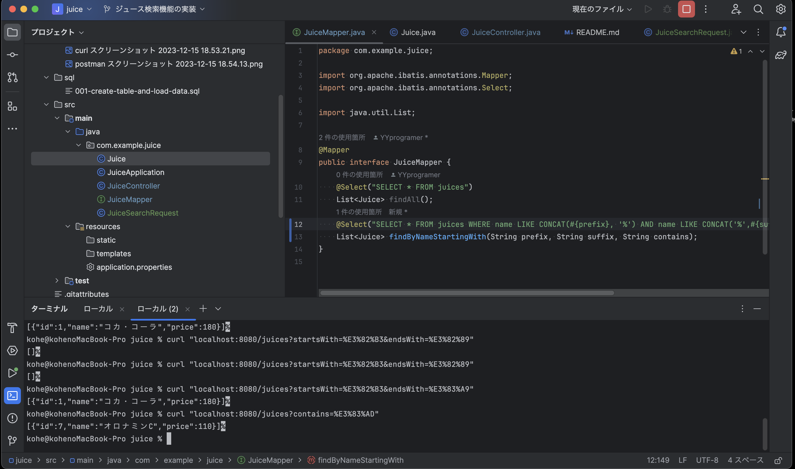
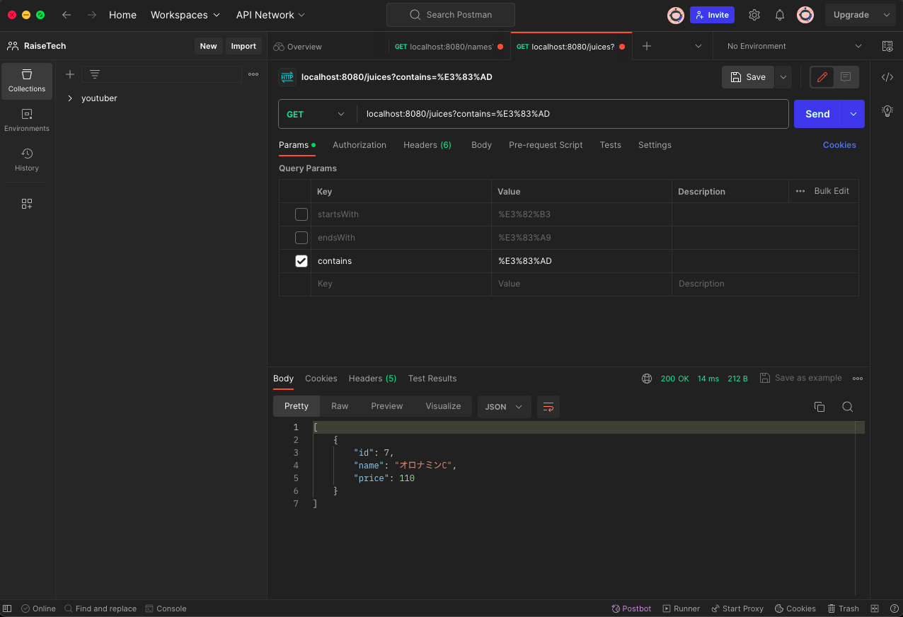

# クエリ文字列を使用した検索

## 仕様
ジュースの名前と値段を格納したデータベースを作成。  
そこから、ジュースの名前を検索し、該当する場合は「ID」『名前』「値段」を表示させます。

## クエリ文字列を使用した前方一致の検索結果
### cURLコマンド

### Postman

## クエリ文字列を使用した一部一致の検索結果
### cURLコマンド

### Postman

