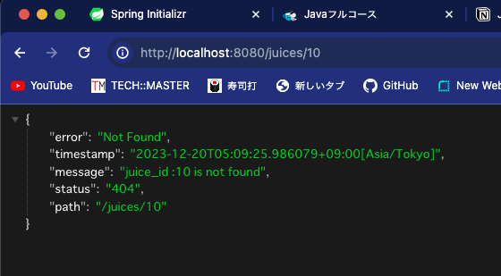
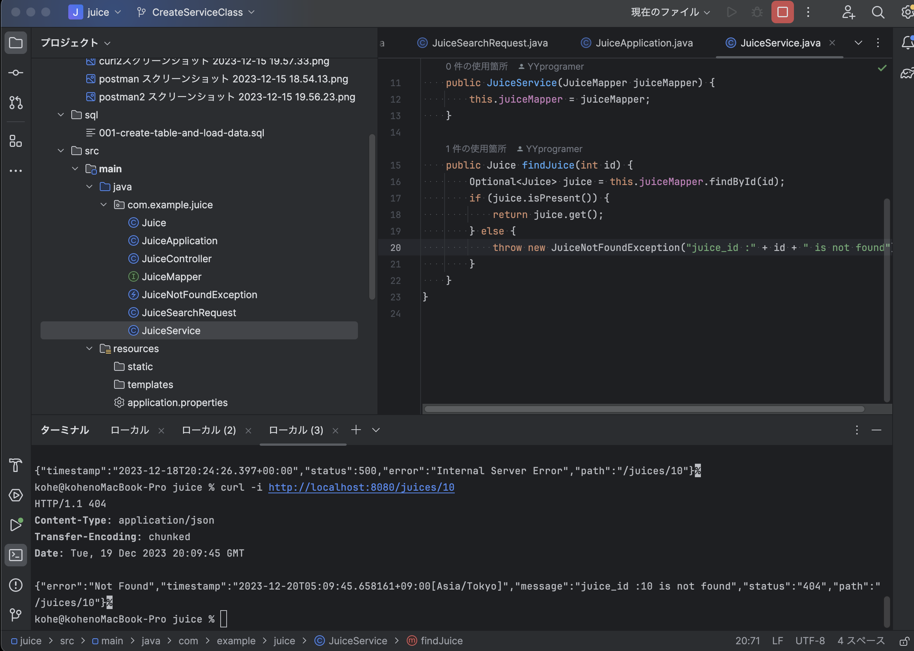
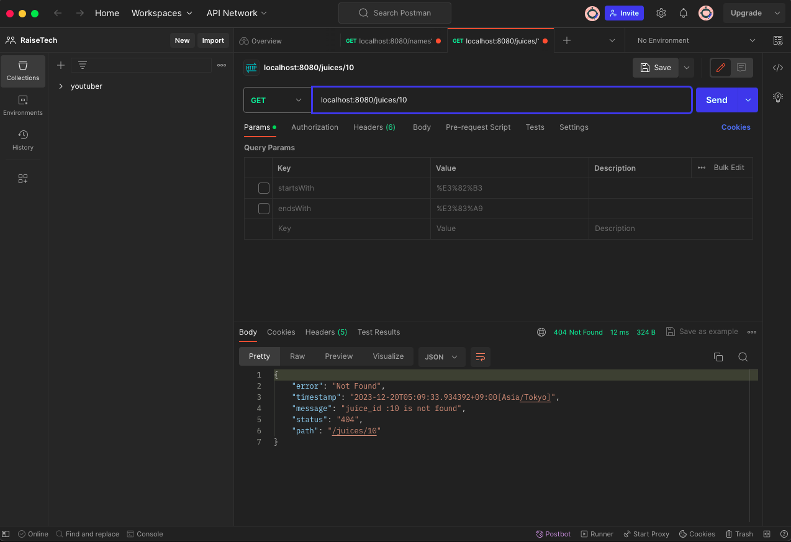

# Serviceクラスを使用したエラーハンドリング

## 仕様
JuiceServiceクラスを作成し、存在しないIDが検索された場合JuiceNotFoundExceptionが動作しエラーメッセージを表示させる。標準だと500のエラーがあ表示されるので、Serviceクラスを作成し404のエラーに修正します。

## 存在しないIDを検索した場合の挙動
### ブラウザ

### cURLコマンド

### Postman

## クエリ文字列を使用した一部一致の検索結果
### cURLコマンド

### Postman

# クエリ文字列を使用した検索

## 仕様
ジュースの名前と値段を格納したデータベースを作成。  
そこから、ジュースの名前を検索し、該当する場合は「ID」『名前』「値段」を表示させます。

## クエリ文字列を使用した前方一致の検索結果
### cURLコマンド

### Postman

## クエリ文字列を使用した一部一致の検索結果
### cURLコマンド

### Postman

